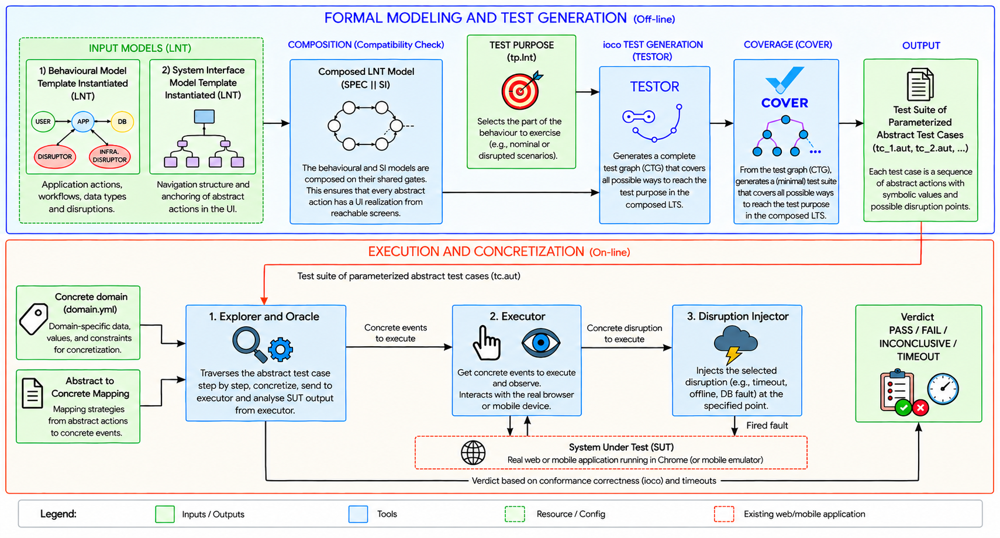

# STORM

**Behavioural conformance testing of web and mobile applications under real-world disruptions.**

STORM tests whether an application keeps its promises when things go wrong. You describe how the application should behave, including what it owes the user when a database write fails, a server stops answering or the app is killed mid-save. STORM then generates conformance tests from that description, injects the disruptions into the running application at the exact point each test calls for, and returns a verdict grounded in ioco theory.

This repository holds the STORM tool and the six case studies used to evaluate it.

## What STORM gives you

- **Disruptions as part of the specification.** Faults are gates of the behavioural model. The test generator places each fault where the test purpose asks, and the specification states what the user is owed afterwards.
- **Formal test generation.** Test cases come from the CADP toolbox and TESTOR under the ioco conformance relation. Every FAIL is an observed contradiction of the specification, not a heuristic.
- **Concrete tests, generated end to end.** The behavioural model and a System Interface model are composed before generation. Every test case therefore already contains the real UI steps (navigate, click, type, wait, observe), with no hand-written test scripts.
- **Verified fault injection.** Each disruption is injected through a declared mechanism (HTTP, shell, SQL, adb). A probe confirms it took effect, and it is restored after the run. A run whose fault could not be confirmed gets no verdict.
- **Honest verdicts.** PASS, FAIL or INCONCLUSIVE come from walking the test case. Silence is a FAIL only where the test case forbids it. A run the tester could not complete is reported separately as UNEXECUTABLE and is never counted as a verdict.
- **Web and Android.** Selenium drives web applications; Appium (UiAutomator2) drives Android applications.
- **Reusable templates.** A behaviour template and a System Interface template capture the structure shared by every case study (`framework/template/`).

## How it works



1. **Model the behaviour.** Write USER, APP, DATABASE and DISRUPTOR processes in LNT. A fault takes one of four shapes: interrupt, write-path, pre-armed or parameter.
2. **Model the interface.** The System Interface gives each abstract action its concrete UI steps.
3. **Compose and check.** `check_alphabet.py` verifies that the specification, interface, composition, purposes and configuration share one alphabet. CADP then builds SPEC ‖ SI.
4. **Generate.** For each test purpose, TESTOR builds the complete test graph and `extract_all` extracts its controllable test cases.
5. **Execute.** The walker runs each test case against the live application, hands fault gates to the disruption executor, and judges every observation against the test case.

## Repository layout

```
framework/
  concretization/      the execution engine
    algorithm.py         walker and verdict rules
    executors.py         Selenium (web) and Appium (Android) executors
    disruptor.py         disruption executor: inject, verify, restore
    fault_injector.py    Android fault injection over adb
    observation_oracle.py  checkpoint oracle driven by type_description.yml
    si_lnt_parser.py     System Interface parser
  scripts/             run.py (execute a test case), check_alphabet.py,
                       check_controllability.py, coverage_report.py,
                       classify_failure.py, eval_tables.py
  tests/               unit tests (pytest)
  template/            behaviour, System Interface, test-purpose and
                       configuration templates
EVALUATION/
  <app>/               one directory per case study:
    model/               specification, System Interface, composition (LNT)
    Test_Purposes/       tp_*.lnt; compiled/ holds them as .aut and .bcg
    CTG/                 complete test graph per purpose (.ctg.aut, .ctg.bcg),
                         ctg_sizes.tsv; v1/ for FoodYou's first campaign
    Test_Cases/          test cases as walked (variants/<purpose>/tc_*.N.aut);
                         as_generated*/ holds them exactly as TESTOR produced
                         them (.aut, .bcg)
    Execution_Logs/      one execution log per test case (<purpose>/vN.log)
    Verdicts/            one verdict row per test case (variants_<purpose>.log)
    Generation/          generator inputs, timings and model sizes
                         as run on the CADP host
    testor/              <app>.io, generate_tc_all.sh
    properties/          concrete_domain.yml, type_description.yml,
                         disruption_mapping.yml
    setup/               our patches and configuration for the application
```

## Requirements

- Python 3.9 or later
- [CADP](https://cadp.inria.fr) with a licence, and TESTOR 3.8, available from its authors. These are needed for test generation only.
- Google Chrome, for web applications
- For Android applications: the Android SDK with an emulator, `adb`, Appium 2 with the UiAutomator2 driver, and the Python client: `pip install Appium-Python-Client`
- Docker, to run the web case studies locally

Install the Python dependencies:

```sh
python3 -m venv .venv
.venv/bin/pip install -r requirements.txt
.venv/bin/pip install exrex Appium-Python-Client
```

Check the installation:

```sh
.venv/bin/python -m pytest framework/tests
```

## Quick start

The steps below use the Mastodon case study; every case study has the same layout.

**1. Check the models agree.**

```sh
.venv/bin/python framework/scripts/check_alphabet.py EVALUATION/mastodon
```

**2. Generate test cases** on the machine that holds the CADP licence:

```sh
cd EVALUATION/mastodon/testor
sh generate_tc_all.sh
```

This writes the test cases to `Test_Cases/variants/<purpose>/`, the size of the composed model, and `gen_times.tsv` (generation time per purpose). The cases used in the evaluation are already in the repository.

**3. Execute a test case** against a running Mastodon (see [Setting up the case studies](#setting-up-the-case-studies)):

```sh
PYTHONPATH=framework .venv/bin/python framework/scripts/run.py \
  --aut EVALUATION/mastodon/Test_Cases/tc_app_write_fail.aut \
  --platform html --url https://mastodon.localhost \
  --system-interface   EVALUATION/mastodon/model/system_interface_mastodon.lnt \
  --concrete-domain    EVALUATION/mastodon/properties/concrete_domain.yml \
  --type-description   EVALUATION/mastodon/properties/type_description.yml \
  --disruption-mapping EVALUATION/mastodon/properties/disruption_mapping.yml \
  --timeout 10 --report
```

Use `--platform android` for an Android application. The command prints the verdict. The exit code is 2 when the run was UNEXECUTABLE.

**4. Tabulate a campaign.**

```sh
.venv/bin/python framework/scripts/eval_tables.py EVALUATION/mastodon --latex
```

## Case studies

| Application | Platform | Domain | What is modelled | Results |
|---|---|---|---|---|
| [FoodYou](https://github.com/maksimowiczm/FoodYou) | Android | Nutrition | Searching foods, logging and removing diary entries, the daily calorie total | [EVALUATION/foodyou](EVALUATION/foodyou) |
| [MedTimer](https://github.com/Futsch1/medTimer) | Android | Health | Creating medicines, marking doses taken or skipped, correcting and deleting dose records, pill stock | [EVALUATION/medtimer](EVALUATION/medtimer) |
| [SimpleBaby](https://github.com/adulbrich/SimpleBaby) | Android | Childcare | Logging and deleting feedings, the feeding history, manual sleep entries, the sleep stopwatch | [EVALUATION/simplebaby](EVALUATION/simplebaby) |
| [Spliit](https://github.com/spliit-app/spliit) | Web | Finance | Creating, viewing and deleting group expenses, the group total, the activity log | [EVALUATION/spliit](EVALUATION/spliit) |
| [Moodle](https://github.com/moodle/moodle) | Web | Education | Quiz attempts, assignment submission and grading | [EVALUATION/moodle](EVALUATION/moodle) |
| [Mastodon](https://github.com/mastodon/mastodon) | Web | Social networking | Publishing and deleting posts, the home timeline and profile, the post count | [EVALUATION/mastodon](EVALUATION/mastodon) |

Disruptions are organised by the layer they strike:

| Layer | Examples |
|---|---|
| User | app killed or page left mid-write, expired session, lost connection |
| Application | silently rejected write, unresponsive server, stale cache, failing external service, delayed background processing |
| Database | aborted transaction, corrupted record, lost event |
| Infrastructure | database or background worker down, full or failing storage |
| Input | invalid or over-limit values |

Each case study's folder holds what is needed to regenerate its numbers: one verdict row per test case (`variants_*.log`), the CTGs, the test cases, and the generator inputs and logs. Run `eval_tables.py` on a folder to rebuild its results table. [Mastodon](EVALUATION/mastodon) is a complete example: 16 test purposes and 31 test cases.

## Setting up the case studies

The applications under test are not part of this repository. Each is cloned at the exact commit the campaigns ran against, into `EVALUATION/<app>/sut/`. Our changes to an application's build or deployment are in `EVALUATION/<app>/setup/`. You only need an application to **execute** test cases: generating them needs only the models in this repository.

| Application | Repository | Version / commit | Platform |
|---|---|---|---|
| FoodYou | https://github.com/maksimowiczm/FoodYou | 3.4.8, `35ab8f1e9ad54194dbc9521fe89d752c913d3cae` | Android emulator, Appium |
| MedTimer | https://github.com/Futsch1/medTimer | `abd19508809d0501b59dbf175ca4241d1999b392` | Android emulator, Appium |
| SimpleBaby | https://github.com/adulbrich/SimpleBaby | `a46e3cf2939e00f7b4b966b87f5e0694fa42fdb9` | Android emulator, Appium, local Supabase |
| Spliit | https://github.com/spliit-app/spliit | 1.19.1, `d3b151e1506f26fd582c30b09427606cc2fe7826` | Docker, Chrome |
| Moodle | https://github.com/moodle/moodle with https://github.com/moodlehq/moodle-docker | v4.5.12, `b9315ff5cb42e11b40c972f3f7194ba8b0c0bbf8`; moodle-docker `81a20665c2d2322469dc491c1f972ebde90ec014` | Docker, Chrome |
| Mastodon | https://github.com/mastodon/mastodon | v4.7.2, `3987b9fd624010eeeaeb7cad96606b05aa813f6a` | Docker, Chrome |

Clone any of them the same way, run from the repository root. FoodYou is shown here:

```sh
git clone https://github.com/maksimowiczm/FoodYou.git EVALUATION/foodyou/sut/foodyou
git -C EVALUATION/foodyou/sut/foodyou checkout 35ab8f1e9ad54194dbc9521fe89d752c913d3cae
```

Every case study has a seed script that resets the application to a clean, verified state before each test case, and a sweep script that walks every generated test case of a purpose. Read each script's header before running it.

### Android applications (FoodYou, MedTimer, SimpleBaby)

You need the Android SDK (command-line tools), JDK 21, an Android emulator image that allows `adb root`, and an Appium 2 server with the UiAutomator2 driver. Each case study's `env.sh` puts `adb` on the `PATH`, names the device and the Appium port, and reports what is running. Source it in the same shell that runs the tests.

**FoodYou**

```sh
cd EVALUATION/foodyou/sut/foodyou && ./gradlew app:assembleDebug && cd -
source EVALUATION/foodyou/env.sh
bash EVALUATION/foodyou/boot_emulator.sh
bash EVALUATION/foodyou/check_env.sh
bash EVALUATION/foodyou/run_variants.sh happy
```

Install the debug APK the build produces on the emulator with `adb install`. `boot_emulator.sh` starts the emulator with working DNS, because a searchable food database requires internet access. `check_env.sh` refuses to run if the device cannot reach it.

**MedTimer**

```sh
cd EVALUATION/medtimer/sut/medtimer && ./gradlew app:assembleDebug && cd -
source EVALUATION/medtimer/env.sh
sh EVALUATION/medtimer/seed.sh
bash EVALUATION/medtimer/run_variants.sh nominal
```

Install `MedTimer-foss-debug.apk` from the build output with `adb install`. `seed.sh` clears the app's data and grants the notification permission. The walk itself creates the fixture.

**SimpleBaby**

SimpleBaby needs a local Supabase backend (Supabase CLI and Docker) and runs as a release build.

```sh
cd EVALUATION/simplebaby/sut/simplebaby
git apply ../../setup/simplebaby.patch
npm install
supabase start
npx expo prebuild --platform android
cd -
source EVALUATION/simplebaby/env.sh
bash EVALUATION/simplebaby/check_env.sh
sh EVALUATION/simplebaby/seed.sh
bash EVALUATION/simplebaby/run_variants.sh nominal_signed
```

Before you run it, complete these configuration steps:

- **Backend address.** Create `EVALUATION/simplebaby/sut/simplebaby/.env` with `EXPO_PUBLIC_SUPABASE_URL=http://10.0.2.2:54321` and `EXPO_PUBLIC_SUPABASE_KEY` set to the anon key that `supabase start` prints.
- **Plain HTTP.** Because the local backend is plain HTTP, set `android:usesCleartextTraffic="true"` in the generated `android/app/src/main/AndroidManifest.xml`.
- **Release APK.** Build the release APK from `android/` and install it.
- **Separate emulator.** The case study uses emulator `emulator-5556`, so it never collides with the other Android apps.

`check_env.sh` refuses a sweep unless the device, root access, the release build, Appium and Supabase are all in place.

### Web applications (Spliit, Moodle, Mastodon)

You need Docker and Google Chrome.

**Spliit**

```sh
cd EVALUATION/spliit/sut/spliit
git apply ../../setup/spliit.patch
npm install --package-lock-only
cp container.env.example container.env
docker compose up -d
cd -
.venv/bin/python EVALUATION/spliit/setup/fault_middleware.py &
bash EVALUATION/spliit/run_variants.sh nominal
```

The patch pins PostgreSQL 17 and fixes the image build. `fault_middleware.py` is a proxy on port 3002 in front of Spliit on port 3000, through which application faults are injected. STORM drives `http://localhost:3002`. The `app_extapi_fail` purpose also needs the currency service redirected:

```sh
sudo sh -c "echo '127.0.0.1 api.frankfurter.app' >> /etc/hosts"
```

**Moodle**

```sh
export MOODLE_DOCKER_WWWROOT="$PWD/EVALUATION/moodle/sut/moodle"
export MOODLE_DOCKER_DB=pgsql
export MOODLE_DOCKER_WEB_PORT=8080
cp EVALUATION/moodle/sut/moodle-docker/config.docker-template.php EVALUATION/moodle/sut/moodle/config.php
cd EVALUATION/moodle/sut/moodle-docker
bin/moodle-docker-compose up -d
bin/moodle-docker-wait-for-db
bin/moodle-docker-compose exec webserver php admin/cli/install_database.php --agree-license --fullname="STORM" --shortname="storm" --adminpass="test" --adminemail="admin@example.com"
bin/moodle-docker-compose exec -T webserver php /dev/stdin < ../../seed_moodle.php
cd -
bash EVALUATION/moodle/run_variants.sh happy
```

`seed_moodle.php` creates the course, users, quiz and assignment the models refer to. Before every test case, `reset_moodle.php` clears any fault left behind and restores the fixture.

**Mastodon**

```sh
cd EVALUATION/mastodon/sut/mastodon
cp ../../setup/docker-compose.override.yml ../../setup/Caddyfile .
cp .env.production.sample .env.production
```

In `.env.production`, set `LOCAL_DOMAIN=mastodon.localhost` and `DEFAULT_LOCALE=en`, and generate the secrets as described in Mastodon's documentation. Then:

```sh
docker compose run --rm web bundle exec rails db:setup
docker compose up -d
docker compose exec web bin/tootctl accounts create bob --email bob@mastodon.localhost --confirmed --approve
cd -
export MASTODON_PW='<password tootctl printed>'
sh EVALUATION/mastodon/seed.sh
sh EVALUATION/mastodon/run_suite.sh mycampaign
```

The override moves Mastodon's ports out of the way and adds a Caddy proxy that serves `https://mastodon.localhost` with a local certificate, because Mastodon's production mode requires HTTPS. The browser accepts that certificate. `seed.sh` clears every fault, removes bob's posts, and verifies the clean state before each case.

## Following a verdict

Every verdict in the evaluation can be traced through three linked files. Example: Mastodon, test purpose `app_write_fail`, test case 1.

**1. Test case:** what must happen. [`EVALUATION/mastodon/Test_Cases/variants/app_write_fail/tc_app_write_fail.1.aut`](EVALUATION/mastodon/Test_Cases/variants/app_write_fail/tc_app_write_fail.1.aut)

```
des (0, 34, 34)
(19, "ADD !POST_B !PUBLIC !VALID", 20)      user posts B
(20, APP_WRITE_FAIL, 21)                    the fault is injected here
(21, "CLICK !SEL_POST_BUTTON", 22)          click Post
(22, "WAIT_FOR !EL_WRITE_ERROR", 23)        an error message is owed
```

**2. Execution log:** what actually happened. [`EVALUATION/mastodon/Execution_Logs/app_write_fail/v1.log`](EVALUATION/mastodon/Execution_Logs/app_write_fail/v1.log)

```
APP_WRITE_FAIL injected and confirmed
State 22 waits for WAIT_FOR !EL_WRITE_ERROR — it never appeared and this
  state does NOT permit quiescence ... CONFORMANCE FAILURE
Disruption restored and confirmed cleared: APP_WRITE_FAIL
Verdict: FAIL
```

**3. Verdict row:** one line per test case. [`EVALUATION/mastodon/Verdicts/variants_app_write_fail.log`](EVALUATION/mastodon/Verdicts/variants_app_write_fail.log)

```
VARIANT  STATES  TRANSITIONS  TIME_S  VERDICT  NOTE
1        34      34           15      FAIL     injected=1 restored=1  State 22 waits for WAIT_FOR !EL_WRITE_ERROR …
```

How the three connect:

- **Test case → log:** the state numbers line up. The log's "State 22" is the test case's state 22.
- **Log → row:** the row repeats the verdict and the injection status, and its NOTE quotes the log's failure line.
- **Row → table:** the row's states and transitions match the test case's header. Totalling a purpose's rows gives its line in the paper's results tables (`framework/scripts/eval_tables.py` does this).

Every case study uses the same three folders. For FoodYou, the reported campaign is the first one (v1); the material of its later model is in `v2/` sub-folders. Logs written before the tool took its current name had the old name in their banner line; that line was renamed and nothing else in the logs was changed.

## Verdicts

| Outcome | Meaning |
|---|---|
| PASS | The test case reached its `:PASS:` state and every checkpoint matched the specification. |
| FAIL | The application contradicted the specification: a wrong observed value, or no output where the test case forbids silence. |
| INCONCLUSIVE | The application behaved correctly, but the test purpose could not be reached, or silence was permitted at that point. |
| UNEXECUTABLE | Not a verdict. The tester could not carry out the run: a fault not confirmed, a step that could not be applied, a dead end. Fix the cause and run again. |


